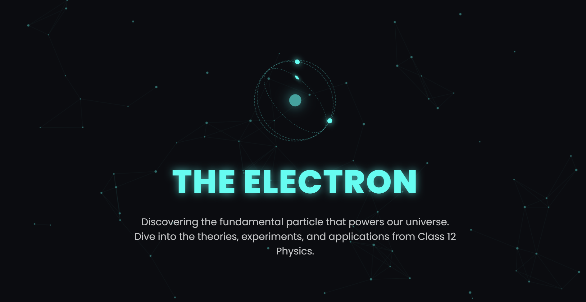
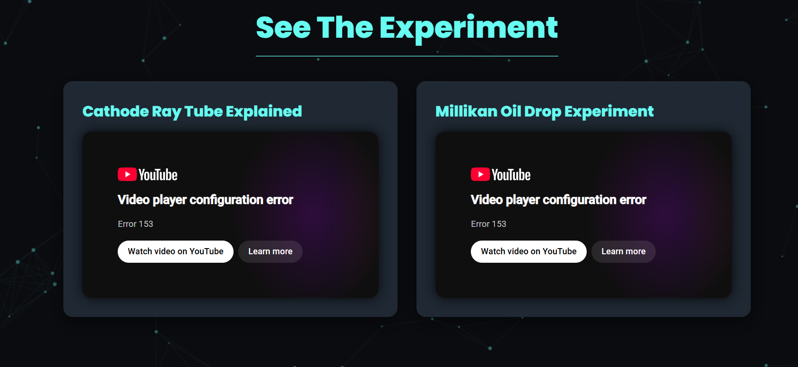
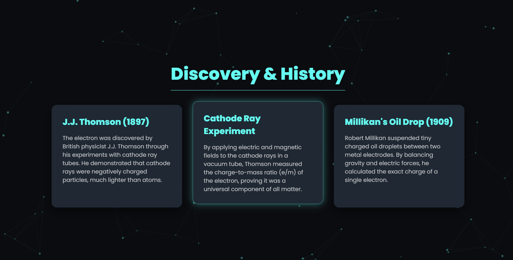

## what It is:
Electron Explorer is atomic physic project which is easy to understand. Users can learn and discover the electron and how thier experiments where done and watch videos about it with detail info and clear explanation. Some study key points are also provided with formulas.Real life experiments are also shown at the last so people feel how imprtant it was and how it contributed to our world. It have interactive design where users can interact with it and have fun while exploring the website.

## tech $ tools
frontend: HTML5, CSS3(costom key frames and animations)
scripting and canvas: vanilla JS 
AI: Gemini(used for css coding and little animation )

## Prompt

Create a website explaining class 12's physics topic called electron from who and how it was known. Make the website look dark,modern and full of dynamic animation and cool animation and differen formulas of it and why and where they are used and real life examples and the website look atracttive and interactive.

This prompt was given to AI but not all part was used or copy pasted,most of the code was written by me and only used the code to get the idea of how should i make my website look attractive and where should i use AI so i can make it look attractive, interactive and where i have used AI is given below in detail:

## AI USES

At line 8, Ai was used for the URL to import 

At line 33, I used AI for the dynamic Electron view

AT line, i used AI for grid specification 

At line 142, AI was used for the shadow and timing 

At line 172, the formula tag was inspiried from the AI prompted code

At some codes between 90 to 120, the animation style was inspiried from the AI prompted code

After that most of the coding was done by me and defination, experiment explanation, dates of experiment was wrote by me with the help of my books and teachers ,AI suggested yt videos was also included in it. The topics and def,explanation was written in way so common people could undertand it easily and know our history of experiments. AI was used a little for styling and animations and 
the topics explanation and the most of the writting part was done by me.

## Errors
Half of the Errors where corrected using AI(gemini)
line 8: the error was unknown but when i copy pasted the same code given by AI, it got corrected the cause was malformed @
line 140: semicolon error at the end; fixed
line 149: semicolon error at the end; fixed

the code is completed
the program used AI for some parts and most coding was done by me 

## Screenshots

